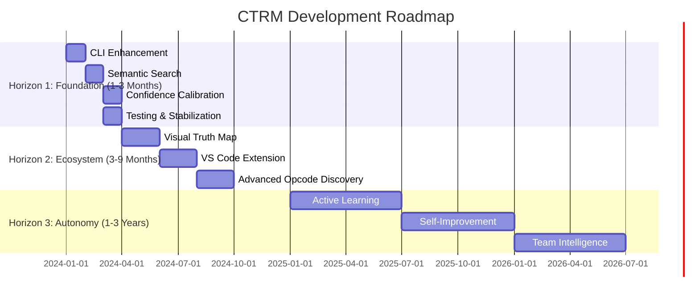
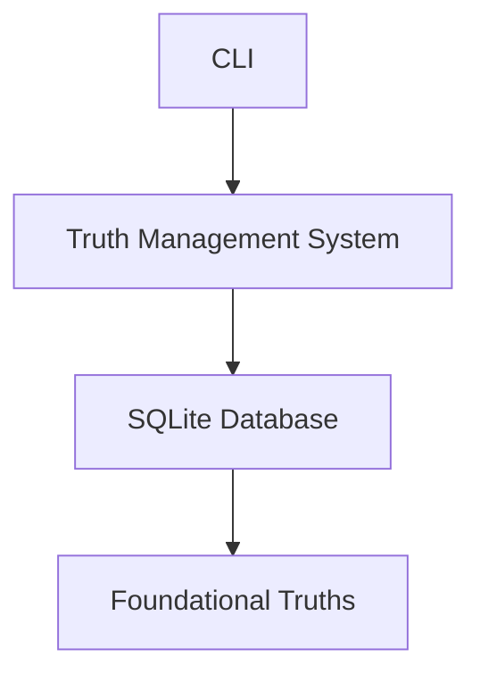
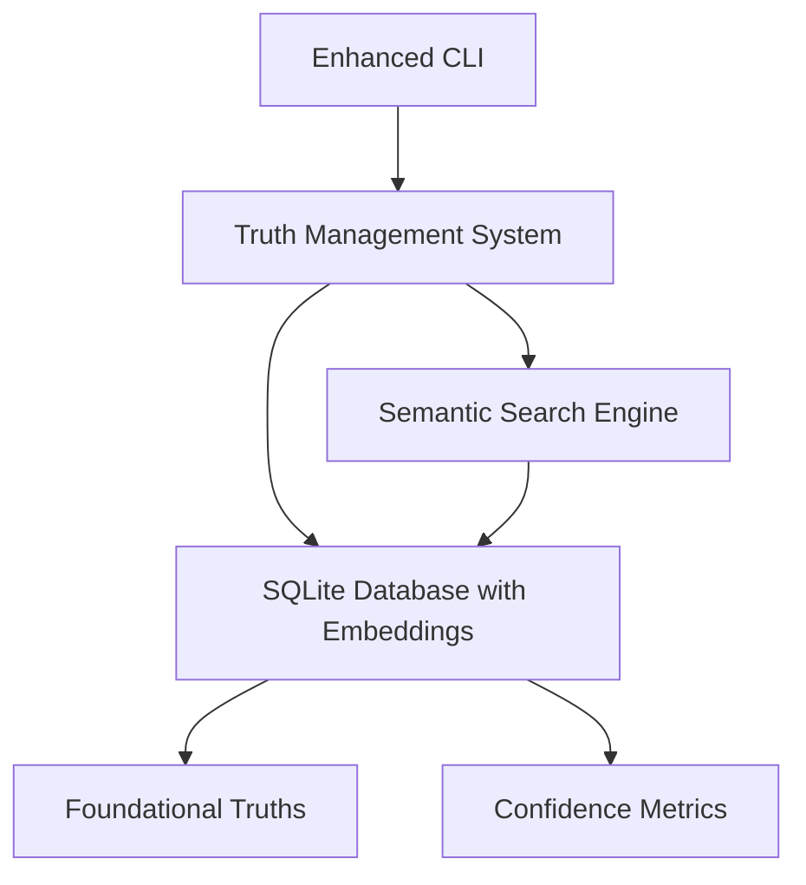
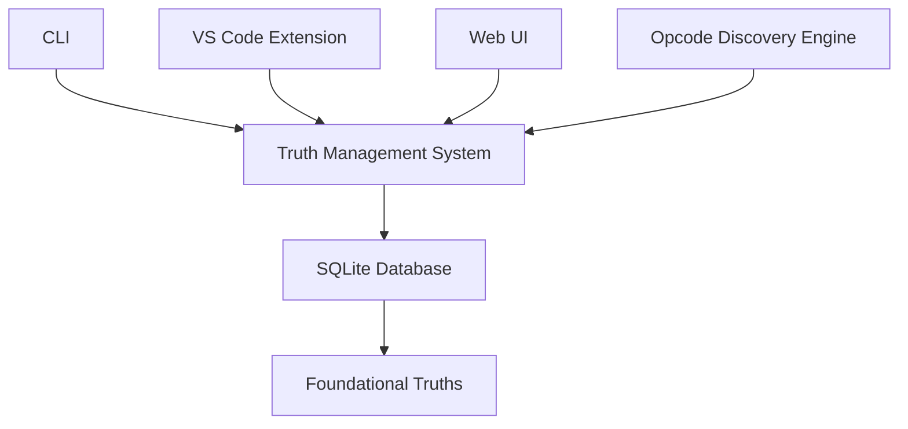
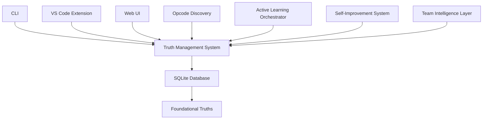

# CTRM Development Roadmap - Visual Guide

## Roadmap Progress Tracker

### 🏗️ Horizon 1: Foundation Enhancement

| Task | Status | Timeline | Key Deliverables |
|------|--------|----------|------------------|
| **Production-Grade CLI** | ⏳ Planned | Month 1 | `ctrm query`, `ctrm status`, `ctrm add-truth` commands |
| **Semantic Search** | ⏳ Planned | Month 2 | Vector embeddings, cosine similarity, improved context retrieval |
| **Confidence Calibration** | ⏳ Planned | Month 3 | Historical accuracy tracking, dynamic confidence adjustment |

### 🌐 Horizon 2: Ecosystem Expansion

| Task | Status | Timeline | Key Deliverables |
|------|--------|----------|------------------|
| **Visual Truth Map** | ⏳ Planned | Months 4-5 | Interactive concentric circle visualization, filtering capabilities |
| **VS Code Extension** | ⏳ Planned | Months 6-7 | Real-time truth display, code highlighting, developer guidance |
| **Advanced Opcode Discovery** | ⏳ Planned | Months 8-9 | Composite opcodes, parameterized patterns, workflow learning |

### 🤖 Horizon 3: Autonomy Achievement

| Task | Status | Timeline | Key Deliverables |
|------|--------|----------|------------------|
| **Active Learning** | ⏳ Planned | Year 1 | Knowledge gap analysis, question formulation, developer interaction |
| **Self-Improvement** | ⏳ Planned | Year 2 | Performance analysis, improvement planning, safe auto-implementation |
| **Team Intelligence** | ⏳ Planned | Year 3 | Multi-user knowledge merging, pattern discovery, automated mentorship |

## Current State Assessment

### ✅ Completed Foundational Elements
- [x] Truth 000 and Truth 001 implementation
- [x] Basic truth management system
- [x] CLI initialization command
- [x] SQLite database schema
- [x] Project structure and configuration

### 🚀 Next Immediate Steps (Horizon 1)
1. **Enhance CLI with practical commands**
   - Implement `ctrm query` for truth searching
   - Add `ctrm status` for system overview
   - Create `ctrm add-truth` for manual truth entry

2. **Integrate semantic search capabilities**
   - Add vector embedding storage to database
   - Implement sentence transformer integration
   - Replace keyword matching with semantic search

3. **Build confidence calibration system**
   - Create prediction outcome tracking
   - Implement historical accuracy calculation
   - Add dynamic confidence gate adjustment

## Visual Architecture Evolution

### Current Architecture

### Horizon 1 Target Architecture

### Horizon 2 Target Architecture

### Horizon 3 Target Architecture

## Implementation Priority Matrix

| Feature | Impact | Effort | Priority | Horizon |
|---------|--------|--------|----------|---------|
| CLI Enhancement | High | Low | 1 | 1 |
| Semantic Search | Very High | Medium | 1 | 1 |
| Confidence Calibration | High | Medium | 2 | 1 |
| Visual Truth Map | Medium | High | 3 | 2 |
| VS Code Extension | High | High | 2 | 2 |
| Advanced Opcode Discovery | Medium | High | 3 | 2 |
| Active Learning | Very High | Very High | 1 | 3 |
| Self-Improvement | Very High | Very High | 2 | 3 |
| Team Intelligence | High | Very High | 3 | 3 |

## Key Performance Indicators

### Horizon 1 Success Metrics
- **CLI Usage:** 80% of team uses CTRM commands daily
- **Search Accuracy:** 40%+ improvement in context retrieval
- **Confidence Reliability:** System achieves 90%+ accuracy calibration

### Horizon 2 Success Metrics
- **Adoption Rate:** 70%+ of team uses VS Code extension
- **Onboarding Time:** 30% reduction in new developer ramp-up
- **Pattern Discovery:** 20%+ of workflows automated via opcodes

### Horizon 3 Success Metrics
- **Autonomy Level:** 20%+ of improvements self-generated
- **Team Alignment:** 80%+ of team follows system-recommended practices
- **Mentorship Impact:** 50%+ reduction in junior developer mistakes

## Risk Assessment and Mitigation

### Technical Risks
| Risk | Likelihood | Impact | Mitigation Strategy |
|------|------------|--------|---------------------|
| Semantic search performance issues | Medium | High | Model quantization, caching, incremental rollout |
| Database scalability problems | High | Medium | Index optimization, query analysis, sharding if needed |
| Self-improvement safety concerns | Low | Very High | Multi-layer validation, sandbox testing, human oversight |

### Adoption Risks
| Risk | Likelihood | Impact | Mitigation Strategy |
|------|------------|--------|---------------------|
| Developer resistance to change | Medium | High | Focus on immediate benefits, comprehensive training |
| Learning curve too steep | High | Medium | Progressive disclosure, contextual help, tutorials |
| Integration complexity | Medium | High | Modular design, multiple integration levels |

This visual roadmap provides a clear, actionable plan for transforming CTRM from its current foundation into the fully realized autonomous system, while maintaining alignment with Truth 000 throughout the development journey.